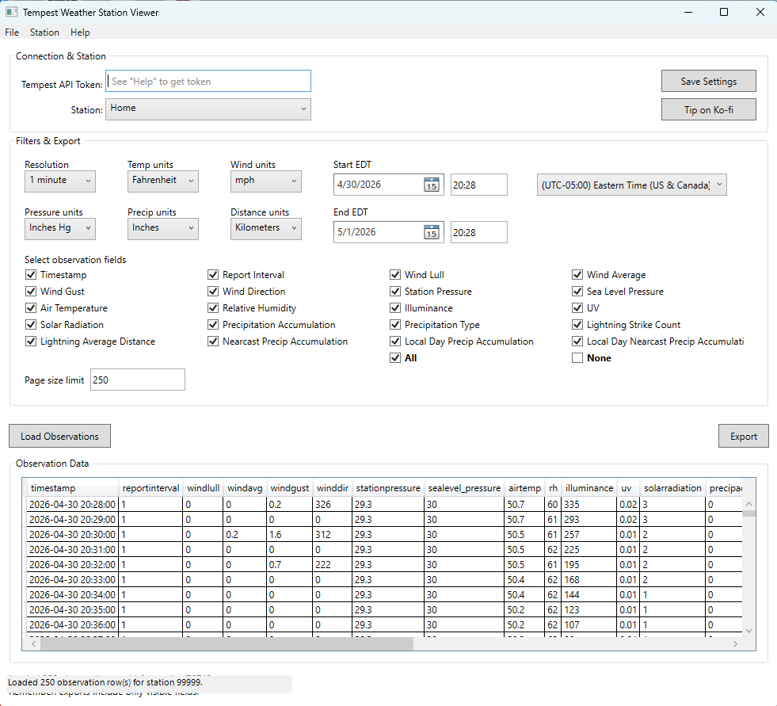

# TempestData – Tempest Weather Station Viewer

[](https://github.com/MABeatty1978/TempestData/releases/latest)
[](LICENSE)

A Windows desktop application for viewing and exporting observation data from your
[WeatherFlow Tempest](https://weatherflow.com/tempest-weather-system/) weather station.

---

## Screenshot



---

## Features

- **Live station discovery** — connects to the Tempest API and lists all stations
  associated with your API token.
- **Flexible field selection** — choose exactly which observation fields to load
  (temperature, humidity, wind, pressure, UV, lightning, battery, and more).
- **Configurable time range** — pick any start/end date and time, displayed in your
  chosen timezone.
- **Timezone-aware display** — timestamp column is automatically converted from UTC
  to the timezone you select.
- **Unit preferences** — choose your preferred units for temperature, wind speed,
  pressure, precipitation, and distance.
- **Bucket resolution** — aggregate observations at 1 min, 5 min, 30 min, 3 hr, or
  1 day resolution.
- **Export in multiple formats** — CSV, JSON, Excel (.xlsx), and PDF.
- **Numeric column sorting** — click any column header to sort by true numeric value.
- **Large-dataset warning** — warns you before loading more than ~2 000 rows.
- **Settings persistence** — API token, station, units, and field preferences are
  saved automatically between sessions.

---

## Download

**[⬇ Download TempestData.exe](https://github.com/MABeatty1978/TempestData/releases/latest)**

Grab the latest self-contained Windows executable from the Releases page — no .NET
installation required. Just download and run.

---

## Requirements

- Windows 10 / 11 (64-bit)
- A [WeatherFlow Tempest API token](https://tempestwx.com) (free)

No additional software installation is required when using the published single-file
executable.

---

## Getting Your API Token

1. Go to [https://tempestwx.com](https://tempestwx.com) and log in.
2. Click **Settings**.
3. Scroll down to **Data Authorizations**.
4. Click **Create Token**.
5. Copy the token and paste it into the **Tempest API Token** field in the app.

---

## Running the App

### Pre-built executable

Download `TempestData.exe` from the [Releases](https://github.com/MABeatty1978/TempestData/releases/latest) page and double-click it. No installation needed.

### Building from source

Requires [.NET 8 SDK](https://dotnet.microsoft.com/download).

```powershell
dotnet build
dotnet run
```

Publishing a self-contained single-file executable:

```powershell
dotnet publish -c Release -r win-x64 --self-contained true `
  -p:PublishSingleFile=true -p:IncludeNativeLibrariesForSelfExtract=true
```

Output: `bin\Release\net8.0-windows\win-x64\publish\TempestData.exe`

---

## License

This project is licensed under the
[Creative Commons Attribution-NonCommercial 4.0 International (CC BY-NC 4.0)](LICENSE)
license.

You are free to use, copy, and modify this software for personal and non-commercial
purposes, provided you give appropriate credit. **Commercial use or resale requires
explicit written permission from the author.**

---

## Support

If you find this app useful, please consider leaving a small tip — it helps me keep
building and maintaining free tools like this!

[](https://ko-fi.com/michaelbeatty9142002)

Thank you! ☕
